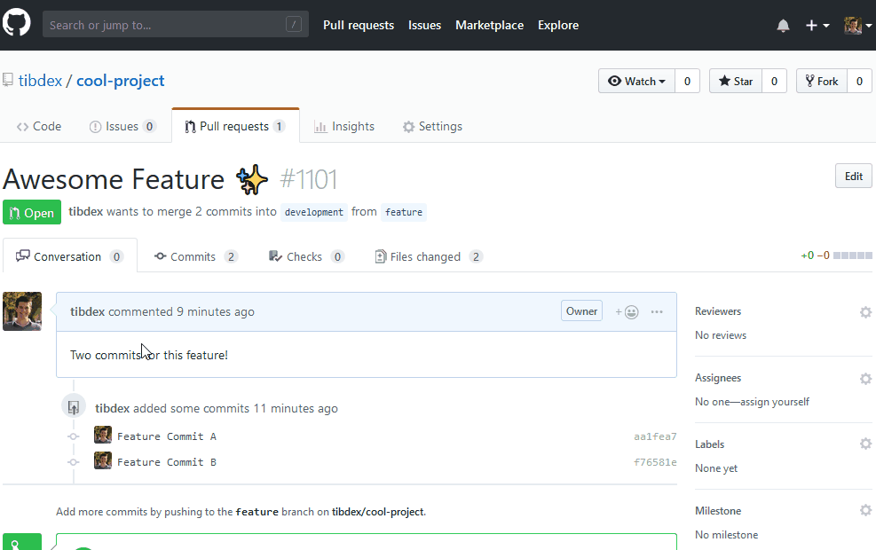

# Goal

Backport is a GitHub App, based on [Probot](https://probot.github.io/), to backport a pull request by simply adding a label to it. [Try it!](https://github.com/apps/backporting)

# Usage

1.  :electric_plug: Install the publicly hosted [Backport GitHub App](https://github.com/apps/backporting) on your repository.
2.  :speech_balloon: Let's say you want to backport a pull request on a branch named `production`. Then label it with `backport production`. (See [how to create labels](https://help.github.com/articles/creating-a-label/).)
3.  :sparkles: That's it! When the pull request gets merged, it will be backported to the `production` branch. If the pull request cannot be backported, a comment explaining why will automatically be posted.

## Demo

This pull request has two commits and targets the `development` branch. After labeling it with `backport production` and merging it, Backport automatically creates a pull request on the `production` branch by cherry-picking these two commits.

# How it Works

Backport relies on [`github-backport`](https://www.npmjs.com/package/github-backport) to perform all the required Git operations directly through the GitHub REST API instead of having to clone repositories on a server and executing Git CLI commands.

`github-backport` is the :old_key: to being able to run Backport as a stateless, easy to maintain, and cheap to operate, GitHub App!

## Which Permissions & Webhooks Is Backport Using?

### Permissions

- **Repository contents** _[read & write]_: because the backporting process requires creating commits and manipulating branches.
- **Issues** _[read & write]_: to post comments when the backport process fails.
- **Pull requests** _[read & write]_: to create new pull requests.

### Webhooks

- **Pull requests**: to detect when pull requests are merged or labeled.
